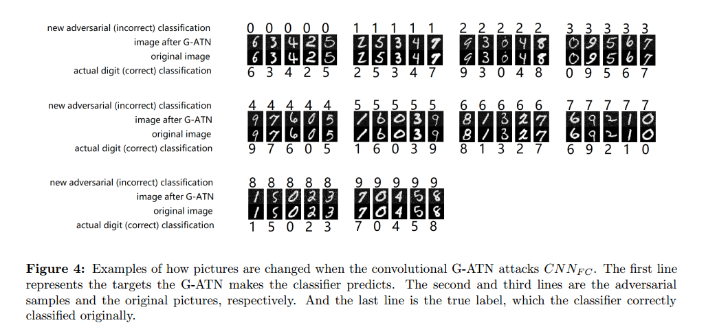

# Gradient Adversarial Transformation Network
University of Michigan-Shanghai Jiao Tong University Joint Intitute 2018SU Machine Learning and Data Mining(VE488) course project

In this project, we implement and enhanced the algorithm introduced in ["Adversarial Transformation Networks: Learning to Generate Adversarial Examples"](https://arxiv.org/abs/1703.09387) by adding gradient as input with advanced architecture.

Group member: Liu Hongyi, Zhang Bohao, Guo Lingyun, Fang Yan

Thanks to all people contributing to this project!
## Abstract
We present an innovative method to generate adversarial samples for CNN image classifier. The idea is to train a model which takes the original image and a target label as inputs and output a new image with targeted misclassification label as well as a minimized difference on original features. With the information of gradients on original classifier as extra input, we effectively trained a neural network image generator. We tested the feasibility of our method on the mnist dataset with two different versions of the model on two different classifiers. The result verified that our method is effective. Our model can efficiently reduce the performance of both classifiers while preserving a high consistency with the original images. On the other hand, our model can mislead the classifier to generate a specific-targeted wrong prediction with high accuracy with a small executing time cost.
## Sample Result

For more detail, please see our report "Generating Adversarial Sample with G-ATN.pdf"

